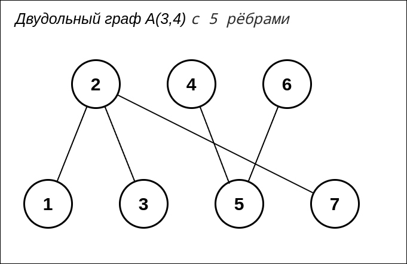

## Домашнее задание

* Нарисовать двудольный граф А(3,4) с 5 рёбрами. Приложить фото/скрин.

* Создать структуру данных для его представления и заполнить её.
  * перечисление множеств:
    - src/presents/Lists/GraphVerticesEdgesLists.java
  * матрица смежности
    - src/presents/Matrices/GraphAdjacencyMatrix.java
  * матрица инцидентности
    - src/presents/Matrices/GraphIncidenceMatrix.java
  * перечень рёбер
    - src/presents/Lists/GraphEdgeList.java
  * векторы смежности
    - src/presents/AdjacencyArray/GraphAdjacencyVector.java
  * массивы смежности
    - src/presents/AdjacencyArray/GraphAdjacencyArray.java
  * списки смежности
    - src/presents/Lists/GraphAdjacencyList.java
  * структура с оглавлением
    - src/presents/Matrices/GraphIndexedStructure.java

## Домашнее задание

### Нарисовать и сохранить граф
### Цель:

В этом домашнем задании вы потренируетесь задавать граф различными способами.

### Описание/Пошаговая инструкция выполнения домашнего задания:
### Задание

**JUNIOR** 
* 1 байт. нарисовать двудольный граф А(3,4) с 5 рёбрами. Приложить фото/скрин.
* Создать структуру данных для его представления и заполнить её.
  * 1 байт. перечисление множеств
  * 1 байт. матрица смежности
  * 1 байт. матрица инцидентности

**MIDDLE** 
* 1 байт. перечень рёбер
* 1 байт. векторы смежности
* 1 байт. массивы смежности
* 1 байт. списки смежности

**SENIOR**
* 1 байт. структура с оглавлением
* 1 байт. список вершин и список рёбер

### Критерии оценки:

### Критерии оценки:
* 1 байт - алгоритм запрограммирован, но не работает, 
  * 2 байта - алгоритм работает верно, но не оптимально, или есть несоответствия требованиям (например, сделано способом, отличным от указанного) 
  * 3 байта - алгоритм работает верно и написан максимально эффективно (нет лишних действий замедляющих работу)
* 1 байт. Задание сдано в срок.
* 1 байт. Выполнено дополнительное задание 1
* 1 байт. Выполнено дополнительное задание 2

**_Двудольный граф А(3,4) с 5 рёбрами:_**
