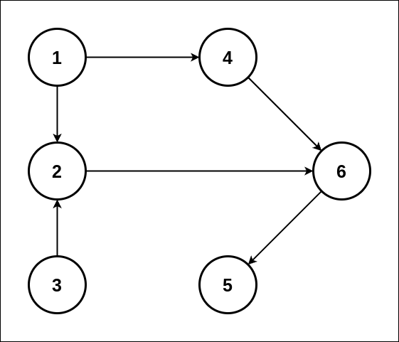
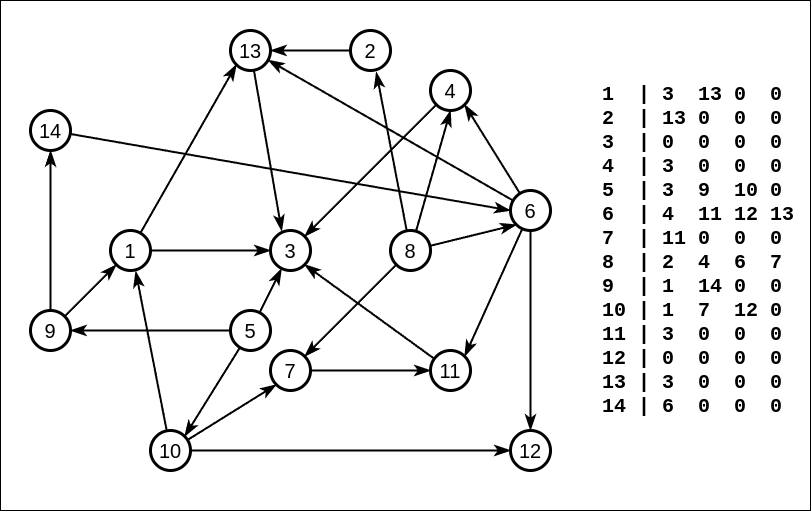
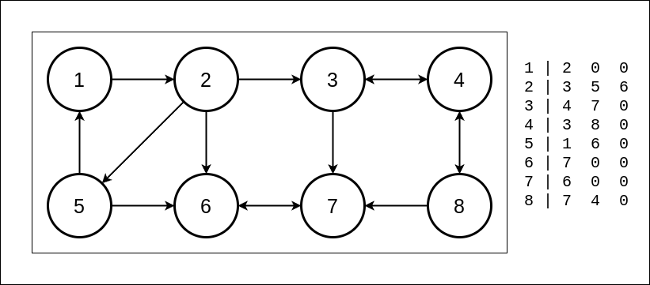

## Домашнее задание

### Алгоритм Демукрона

* алгоритм Демукрона:
  * src/sortings/Demukron.java
* алгоритм Кана:
  * src/sortings/Kahn.java
* алгоритм Тарьяна:
  * src/sortings/Tarjan.java
* алгоритм Косарайю:
  * src/Kosaraju/Kosaraju.java

Для проверки топологической сортировки использовались графы:



_(из презентации)_<br><br><br>



_(из приложенных материалов)_<br><br><br>

Для проверки алгоритма Косарайю  сортировки использовался граф из презентации:


<hr>
<hr>

## Домашнее задание

### Алгоритм Демукрона
### Цель:

В этом домашнем задании вы научитесь реализовывать алгоритм Демукрона.

<hr>

### Описание/Пошаговая инструкция выполнения домашнего задания:
* Реализовать алгоритм Демукрона
* Граф задан вектором смежности ```int A[N][Smax]```. Это п.5 в структурах данных в лекции. Отличие только в том, что вершины нумеруются от 0 а не от 1, и номера самой вершины первым столбцом в матрице не будет, будут только номера смежных вершин

### Задание:
* Реализовать алгоритм Демукрона
* Если понадобится использование стека/очереди обязательно применение собственных структур данных из предыдущих занятий
* Можно использовать стандартный массив [] встроенный в язык
* Выходные данные:
  * Результат должен быть представлен в виде массива ```int[][] level``` где первый индекс - номер уровня, на каждом уровне массив, с номерами вершин, принадлежащих этому уровню

### Дополнительное задание 1
* Реализовать алгоритм Тарьяна
### Дополнительное задание 2
* Реализовать алгоритм поиска мостов или точек сочленения


<hr>

### Критерии оценки: 
1. 
   * 1 балл - алгоритм запрограммирован, но не работает; 
   * 2 балла - алгоритм работает верно, но не оптимально, или есть несоответствия требованиям (например, сделано способом, отличным от указанного); 
   * 3 балла - алгоритм работает верно и написан максимально эффективно (нет лишних действий замедляющих работу).
2. 1 балл. Задание сдано в срок.
3. 1 балл. Выполнено дополнительное задание 1
4. 1 балл. Выполнено дополнительное задание 2
