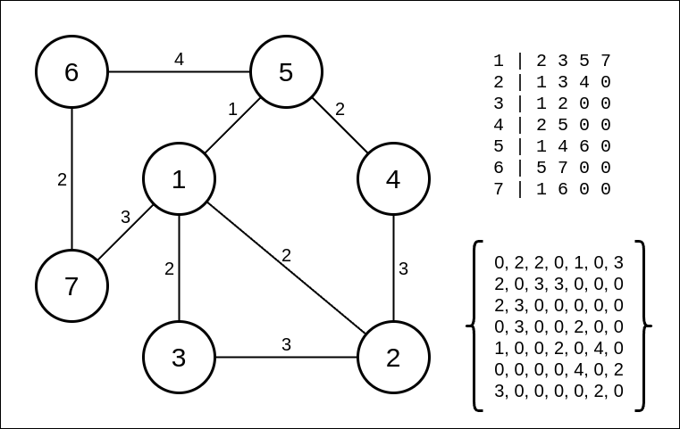

## Домашнее задание

Граф, использовавшийся для проверки:<br> 


**Файлы:**
* алгоритм Краскала:
   * src/spanningTree/Kruskal.java
* алгоритм Прима:
   * src/spanningTree/Prim.java
* алгоритм Борувки:
   * src/spanningTree/Boruvka.java

<hr>
<hr>

## Домашнее задание

### Реализовать алгоритм нахождения минимального остовного дерева
### Цель:

В этом домашнем задании вы научитесь реализовывать алгоритм нахождения минимального остовного дерева.

<hr>

### Описание/Пошаговая инструкция выполнения домашнего задания:

Реализовать алгоритм Краскала
Граф задан вектором смежности int A[N][Smax]. Это п.5 в структурах данных в лекции. Отличие только в том, что вершины нумеруются от 0 а не от 1, и номера самой вершины первым столбцом в матрице не будет, будут только номера смежных вершин

### Задание:
* Реализовать алгоритм Краскала
* Структура Union-Find собственной реализации.
* Если понадобится использование стека/очереди обязательно применение собственных структур данных из предыдущих занятий
* Можно использовать стандартный массив [] встроенный в язык
* Выходные данные:
* Результат должен быть представлен в виде массива Edge[] edges где Edge - класс, содержащий пару вершин, которые соединяет это ребро

```
Edge
{
int v1;
int v2;
}
```

Для любителей компактного хранения можно упаковать в long два int-а :)
Тогда результат будет long[] edges

### Дополнительное задание 1
Реализовать алгоритм Прима

### Дополнительное задание 2
Реализовать алгоритм Борувки


**ВАЖНО!** При размещении ответа укажите, на каком языке вы выполнили ДЗ. Это поможет нам ускорить его проверку.

### Критерии оценки:

* Критерии оценки: 
  * 1 байт - алгоритм запрограммирован но не работает, 
  * 2 байта - алгоритм работает верно, но не оптимально, или есть несоответствия требованиям (например, сделано способом, отличным от указанного) 
  * 3 байта - алгоритм работает верно и написан максимально эффективно (нет лишних действий замедляющих работу)
* 1 байт. Задание сдано в срок.
* 1 байт. Выполнено дополнительное задание 1
* 1 байт. Выполнено дополнительное задание
